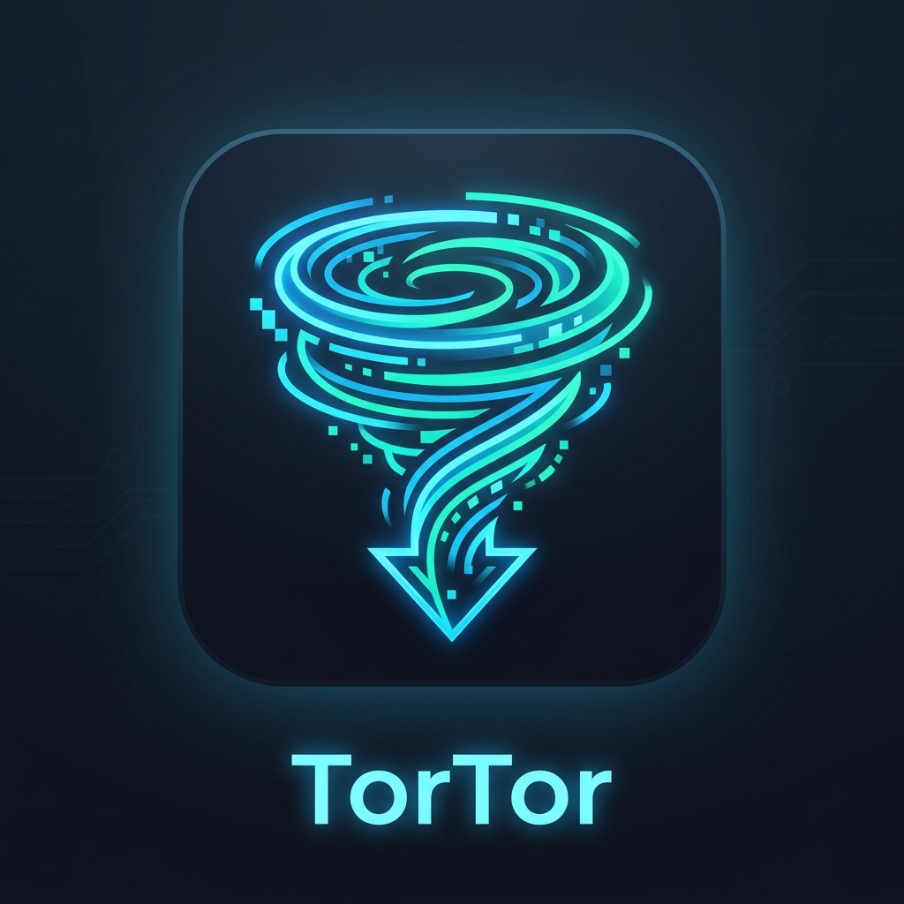

# 🌀 TorTor

*English documentation below | [Русская документация ниже](#русский)*

---

## English

TorTor is a next-generation, high-performance BitTorrent client written in Rust. It combines memory safety with low-level speed through dynamic CPU dispatch and a modular architecture designed for zero-copy I/O evolution.

### Key Features
- **⚡ Dynamic SIMD Dispatch:** Runtime CPU detection for AVX2 and SSE4.1 with a portable fallback path.
- **🛡️ Memory-Safe Core:** Piece verification and protocol logic written in safe Rust by default.
- **📂 Multi-Torrent Manager:** Download and manage multiple torrents simultaneously in a unified session-isolated interface.
- **💻 Hacker-Style ASCII UI:** A gorgeous, cyberpunk-inspired \gui\ dashboard featuring clickable ASCII progress bars (\[██████░░]\) and a deep neon-blue color palette.
- **🚀 Zero-copy I/O:** Built on top of Tokio for blazing-fast asynchronous data handling.

### Installation and Build
Ensure you have the latest stable Rust toolchain installed.

\\\ash
git clone https://github.com/GLK-Dev/tortor.git
cd tortor
\\\

**Auto-compiler (Windows):**
Simply run \uild.bat\ and select \1\ for a fast Beta build or \2\ for a highly-optimized Release build.

**Manual Build:**
\\\ash
cargo build --release
cargo run --release
\\\

### Roadmap
| Feature | Status | Target |
| --- | --- | --- |
| Basic TCP listener and protocol scaffolding | Done | v1.0.0 |
| Dynamic SIMD hashing (AVX2 / SSE4.1) | Done | v1.0.0 |
| Multi-Torrent Download Manager | Done | v1.1.0 |
| ASCII UI, Neon Theme, & App Icon | Done | v1.2.0 |
| Choke/Unchoke Policy & Handshake Layer | Done | v1.3.0 |
| io_uring disk pipeline (Linux) | Planned | v2.0.0 |
| QUIC/WebTransport transport experiments | Planned | v2.0.0 |

---

## Русский

TorTor — это высокопроизводительный BitTorrent-клиент нового поколения, написанный на Rust. Он сочетает в себе безопасность работы с памятью и невероятную скорость за счет динамической маршрутизации процессора и модульной архитектуры, спроектированной для I/O операций с нулевым копированием (zero-copy).

### Ключевые возможности
- **⚡ Динамический SIMD-диспетчер:** Обнаружение возможностей процессора на лету (AVX2 и SSE4.1) с безопасным резервным вариантом.
- **🛡️ Безопасное ядро:** Верификация кусков файлов (pieces) и логика протокола написаны на безопасном Rust.
- **📂 Мульти-торрент менеджер:** Скачивайте и управляйте сразу несколькими торрентами одновременно в изолированных сессиях.
- **💻 Хакерский ASCII Интерфейс:** Потрясающий дашборд на базе \gui\ с кликабельными ASCII-прогресс-барами (\[██████░░]\) в неоновой киберпанк стилистике.
- **🚀 I/O без копирования:** Создано на базе Tokio для молниеносной асинхронной обработки данных.

### Установка и Сборка
Убедитесь, что у вас установлена последняя стабильная версия Rust.

\\\ash
git clone https://github.com/GLK-Dev/tortor.git
cd tortor
\\\

**Автоматический компилятор (Windows):**
Просто запустите файл \uild.bat\ и выберите \1\ для быстрой отладочной сборки или \2\ для максимально оптимизированной релизной сборки.

**Ручная сборка:**
\\\ash
cargo build --release
cargo run --release
\\\

### Дорожная карта
| Функция | Статус | Версия |
| --- | --- | --- |
| Базовый TCP-слушатель и каркас протокола | Готово | v1.0.0 |
| Динамическое SIMD-хэширование (AVX2 / SSE4.1) | Готово | v1.0.0 |
| Менеджер управления несколькими торрентами | Готово | v1.1.0 |
| Хакерский ASCII UI, неоновая тема и иконка | Готово | v1.2.0 |
| Choke/Unchoke Политика и State Machine | Готово | v1.3.0 |
| Дисковый конвейер io_uring (Linux) | В планах | v2.0.0 |
| Эксперименты с QUIC/WebTransport | В планах | v2.0.0 |

---
**Автор:** Создано и поддерживается Виталием Голиком ([mjojo](https://github.com/mjojo)) под эгидой [GLK Dev](https://github.com/GLK-Dev).  
**Лицензия:** Двойная лицензия MIT / Apache-2.0. Подробности в файле LICENSE.
