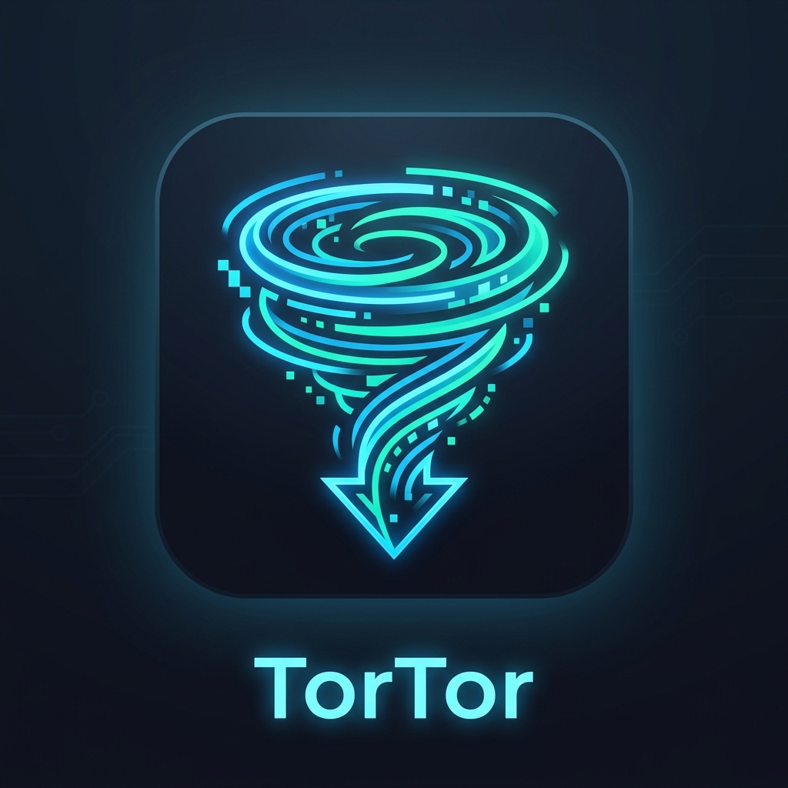

# 🌀 TorTor



[](https://github.com/GLK-Dev/tortor/actions/workflows/ci.yml)

*English | [Русский](#русский)*

---

## English

TorTor is a BitTorrent client written in Rust with a desktop GUI ([egui](https://github.com/emilk/egui)). It runs on Windows and Linux, downloads and seeds several torrents at once, and speaks TCP and IPv6 out of the box.

### Features

- **Several torrents at once** in one window, with per-torrent progress, speed, peers and logs. Sessions are restored on the next start.
- **.torrent files and magnet links.** Magnet metadata is fetched from trackers, the DHT and peers (BEP 9/10) and verified against the info hash.
- **File selection** for multi-file torrents, also while the download is running. Unselected files are not created.
- **Finding peers:** HTTP and UDP trackers (multiple trackers via `announce-list`, IPv6 peers), Kademlia DHT (BEP 5, incl. IPv6 per BEP 32; the node answers queries and announces itself), peer exchange (BEP 11).
- **Uploading:** the client seeds while and after downloading and accepts inbound connections on one port for TCP and QUIC, IPv4 and IPv6. UPnP port forwarding is attempted automatically.
- **Piece picking:** rarest-first with endgame mode; every piece is checked against its SHA-1 hash before it is written.
- **Speed limits** for download and upload (top bar of the window, saved between runs).
- **Crash-safe state:** resume data and the session list are written atomically; progress is recorded only after the data was flushed to disk. Existing files are re-checked when a torrent is added.
- **Hardened parsing:** limits on message sizes and nesting depth, sanitized file paths (no path traversal), validated torrent metadata.
- **Optional QUIC transport** between TorTor clients (TLS 1.3). Other clients are reached over plain TCP.
- **io_uring disk backend on Linux.**

### Not supported (yet)

uTP (BEP 29), BitTorrent v2 / hybrid torrents (BEP 52), protocol encryption (MSE/PE), Fast Extension (BEP 6), local peer discovery (BEP 14), NAT-PMP/PCP, a full tit-for-tat choking algorithm (uploads use a fixed number of slots), sequential download, and downloading from the `--cli` mode (see below). QUIC peers are TorTor-only: it is not a standard BitTorrent transport.

### Build and run

You need a recent stable Rust toolchain ([rustup](https://rustup.rs)).

```bash
git clone https://github.com/GLK-Dev/tortor.git
cd tortor
cargo run --release
```

On Windows you can also run `build.bat` (1 = debug build, 2 = release build).

**Linux:** a C compiler is required to build (`ring`). To run the GUI you need an X11 or Wayland session with OpenGL (Mesa) and the usual desktop libraries (`libxkbcommon`, `libxcb`/`libwayland-client`). The file dialog uses the XDG desktop portal. Without the GUI: `cargo build --release --no-default-features`.

### Usage

```text
tortor [OPTIONS] [MAGNET]

  -t, --torrent <FILE>        open a .torrent file at start
  -o, --output <DIR>          download directory (default: current directory)
      --listen-port <PORT>    first port to try for TCP+QUIC (default: 6881; the DHT uses the next one)
  -v, --verbose               debug logging
      --cli                   no GUI: print torrent info, optionally query the tracker (--announce-tracker)
                              or only listen (--listen-port); does not download
```

In the window, use **+ Add Torrent** or paste a link into the **URL/Magnet** field, choose a directory and press **Start Swarm**. The top bar shows the speed limits (KiB/s, `0` = unlimited) and the port/UPnP status.

Open the port (TCP and UDP, default 6881) in your firewall/router if UPnP is unavailable; without it TorTor still downloads but cannot accept incoming connections.

**Where data is kept**

| What | Windows | Linux |
| --- | --- | --- |
| Session list, limits | `%APPDATA%\TorTor\session.json` | `~/.config/TorTor/session.json` |
| Resume data | `%APPDATA%\TorTor\resume\` | `~/.local/share/TorTor/resume/` |

### Development

```bash
cargo fmt --all -- --check
cargo clippy --all-targets --all-features -- -D warnings
cargo test --all-features
cargo bench --bench hash_bench
```

The tests include end-to-end transfers between real peers over loopback (TCP, QUIC, IPv4, IPv6), magnet metadata download, file selection and the DHT. Two examples talk to the real network: `cargo run --release --example magnet_fetch -- "<magnet>"` and `cargo run --release --example download -- "<magnet>" <dir> [seconds] [file,indexes]`.

Layout: `src/core` (torrent model, piece manager, disk, resume), `src/net` (engine, sessions, trackers, DHT, magnet metadata, UPnP, rate limiting), `src/ui` (GUI), `tests/` (integration tests). See [CHANGELOG.md](CHANGELOG.md) for the history.

### License

Dual-licensed under MIT or Apache-2.0, see [LICENSE](LICENSE).

---

<a id="русский"></a>
## Русский

TorTor — BitTorrent-клиент на Rust с графическим интерфейсом ([egui](https://github.com/emilk/egui)). Работает в Windows и Linux, качает и раздаёт несколько торрентов одновременно, поддерживает IPv6.

### Возможности

- **Несколько торрентов в одном окне:** прогресс, скорость, пиры и журнал по каждому. Сессии восстанавливаются при следующем запуске.
- **.torrent-файлы и magnet-ссылки.** Метаданные magnet-ссылки загружаются у трекеров, из DHT и у пиров (BEP 9/10) и проверяются по info hash.
- **Выбор файлов** в многофайловых торрентах, в том числе во время загрузки. Невыбранные файлы не создаются.
- **Поиск пиров:** HTTP- и UDP-трекеры (несколько трекеров через `announce-list`, IPv6-пиры), DHT Kademlia (BEP 5, IPv6 по BEP 32; узел отвечает на запросы и объявляет себя), обмен пирами (BEP 11).
- **Раздача:** клиент раздаёт во время загрузки и после неё и принимает входящие соединения на одном порту для TCP и QUIC, IPv4 и IPv6. Проброс порта через UPnP включается автоматически.
- **Выбор кусков:** сначала самые редкие, режим endgame; каждый кусок проверяется по SHA-1 до записи.
- **Ограничение скорости** загрузки и раздачи (верхняя панель окна, сохраняется между запусками).
- **Устойчивое состояние:** данные возобновления и список сессий пишутся атомарно; прогресс фиксируется только после сброса данных на диск. При добавлении торрента существующие файлы перепроверяются.
- **Защищённый разбор:** лимиты на размер сообщений и вложенность, очистка путей файлов (нет выхода за каталог загрузки), проверка метаданных торрента.
- **Необязательный транспорт QUIC** между клиентами TorTor (TLS 1.3). С остальными клиентами связь идёт по обычному TCP.
- **Дисковый бэкенд io_uring в Linux.**

### Чего пока нет

uTP (BEP 29), торренты v2 и гибридные (BEP 52), шифрование протокола (MSE/PE), Fast Extension (BEP 6), локальный поиск пиров (BEP 14), NAT-PMP/PCP, полноценный алгоритм choking с оценкой скорости (для раздачи используется фиксированное число слотов), последовательная загрузка и скачивание в режиме `--cli` (см. ниже). QUIC работает только между клиентами TorTor: это не стандартный транспорт BitTorrent.

### Сборка и запуск

Нужна свежая стабильная версия Rust ([rustup](https://rustup.rs)).

```bash
git clone https://github.com/GLK-Dev/tortor.git
cd tortor
cargo run --release
```

В Windows можно запустить `build.bat` (1 — отладочная сборка, 2 — релизная).

**Linux:** для сборки нужен компилятор C (`ring`). Для запуска окна нужна сессия X11 или Wayland с OpenGL (Mesa) и обычные библиотеки рабочего стола (`libxkbcommon`, `libxcb`/`libwayland-client`). Диалог выбора файла использует XDG desktop portal. Сборка без GUI: `cargo build --release --no-default-features`.

### Использование

```text
tortor [ПАРАМЕТРЫ] [MAGNET]

  -t, --torrent <ФАЙЛ>        открыть .torrent при запуске
  -o, --output <КАТАЛОГ>      каталог загрузки (по умолчанию текущий)
      --listen-port <ПОРТ>    первый порт для TCP+QUIC (по умолчанию 6881; DHT использует следующий)
  -v, --verbose               подробный журнал
      --cli                   без окна: вывести сведения о торренте, при желании опросить трекер
                              (--announce-tracker) или только слушать порт (--listen-port); не скачивает
```

В окне нажмите **+ Add Torrent** или вставьте ссылку в поле **URL/Magnet**, выберите каталог и нажмите **Start Swarm**. В верхней панели задаются ограничения скорости (КиБ/с, `0` — без ограничений) и показывается состояние порта и UPnP.

Если UPnP недоступен, откройте порт (TCP и UDP, по умолчанию 6881) в файрволе и на роутере: без этого TorTor качает, но не принимает входящие соединения.

**Где хранятся данные**

| Что | Windows | Linux |
| --- | --- | --- |
| Список сессий, лимиты | `%APPDATA%\TorTor\session.json` | `~/.config/TorTor/session.json` |
| Данные возобновления | `%APPDATA%\TorTor\resume\` | `~/.local/share/TorTor/resume/` |

### Разработка

```bash
cargo fmt --all -- --check
cargo clippy --all-targets --all-features -- -D warnings
cargo test --all-features
cargo bench --bench hash_bench
```

Тесты включают сквозные передачи между реальными пирами по loopback (TCP, QUIC, IPv4, IPv6), загрузку метаданных magnet-ссылок, выбор файлов и DHT. Два примера работают с настоящей сетью: `cargo run --release --example magnet_fetch -- "<magnet>"` и `cargo run --release --example download -- "<magnet>" <каталог> [секунды] [номера,файлов]`.

Структура: `src/core` (модель торрента, менеджер кусков, диск, возобновление), `src/net` (движок, сессии, трекеры, DHT, метаданные magnet, UPnP, ограничение скорости), `src/ui` (интерфейс), `tests/` (интеграционные тесты). История изменений — в [CHANGELOG.md](CHANGELOG.md).

### Лицензия

Двойная лицензия MIT или Apache-2.0, см. [LICENSE](LICENSE).

---
Автор: [mjojo](https://github.com/mjojo), [GLK Dev](https://github.com/GLK-Dev).
